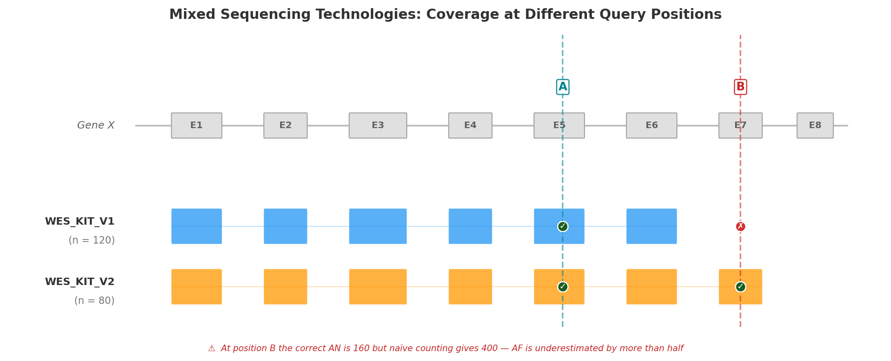

# Why Local Allele Frequencies Matter

## Clinical Decisions Depend on Accurate AF

Allele frequency (AF) is one of the strongest lines of evidence in clinical variant classification. Under the [ACMG/AMP framework](../use-cases/acmg-use-cases.md), AF thresholds directly determine whether a variant is classified as benign (BA1: AF > 5%), supporting-pathogenic (PM2: absent or extremely rare), or strongly pathogenic through case enrichment (PS4). A misestimated AF can flip a classification — and with it, a clinical decision.

Yet AF is not an intrinsic property of a variant — it depends on the population in which it is measured. The same variant can be common in one cohort and absent in another. When the reference population does not match the patient's background, variant classification becomes unreliable.

This page describes four methodological gaps in current allele frequency workflows that AFQuery was designed to address.

---

## Gap 1 — Global Databases Miss Population-Specific Signals

Population databases like gnomAD are invaluable for identifying common variants, but they aggregate data from broad, predominantly European-ancestry populations. When the patient's ancestry differs from the reference, AF estimates diverge — sometimes dramatically.

!!! warning "Real-world impact"
    Turkish breast cancer variants showed up to **354-fold higher** allele frequencies in a local variome compared to gnomAD, leading to **6.7% of VUS being reclassified** to likely benign when population-matched data were used [(Agaoglu et al., 2024)](https://pubmed.ncbi.nlm.nih.gov/38308423/). In Taiwanese inherited retinal degeneration, using a local biobank as ancestry-matched controls for PS4 evidence **upgraded 2 variants from LP to P and 6 from VUS to LP** [(Huang et al., 2026)](https://pubmed.ncbi.nlm.nih.gov/41692763/).

The problem extends beyond rare ancestries. In a UK arrhythmia clinic, **32.2% of VUS were reclassified** upon re-evaluation with updated frequency data [(Young et al., 2024)](https://pubmed.ncbi.nlm.nih.gov/38218330/). Analysis of 469,803 UK Biobank exomes found that **12.4% of rare LDLR VUS met criteria for reclassification** to likely pathogenic when biobank-derived odds ratios were calibrated to ACMG PS4 strength levels [(Bhat et al., 2025)](https://pubmed.ncbi.nlm.nih.gov/40639380/).

These are not edge cases. Every cohort with a population composition that differs from gnomAD — geographically, clinically, or by ascertainment — may produce misleading AF when compared only against global references.

| Study | Population | Key Finding |
|-------|-----------|-------------|
| [Agaoglu et al. 2024](https://pubmed.ncbi.nlm.nih.gov/38308423/) | Turkish breast cancer | Up to 354× AF difference vs gnomAD; 6.7% VUS reclassified |
| [Huang et al. 2026](https://pubmed.ncbi.nlm.nih.gov/41692763/) | Taiwanese IRD | 8 variants reclassified using local biobank PS4 evidence |
| [Young et al. 2024](https://pubmed.ncbi.nlm.nih.gov/38218330/) | UK arrhythmia clinic | 32.2% of VUS reclassified on re-evaluation |
| [Bhat et al. 2025](https://pubmed.ncbi.nlm.nih.gov/40639380/) | UK Biobank (470K) | 12.4% rare LDLR VUS reclassifiable via biobank OR |
| [Kotan 2022](https://pubmed.ncbi.nlm.nih.gov/35438269/) | Turkish endocrinology | Population-matched variomes correlate best geographically |
| [Soussi 2022](https://pubmed.ncbi.nlm.nih.gov/35802772/) | Multi-ethnic (TP53) | 21 benign TP53 SNPs missed in European-biased databases |
| [Dawood et al. 2024](https://pubmed.ncbi.nlm.nih.gov/39627863/) | Multi-ethnic (MAVE) | AF evidence codes have inequitable impact on non-Europeans (p = 7.47×10⁻⁶) |

---

## Gap 2 — Mixed Sequencing Technologies Inflate the Denominator

Modern cohorts routinely combine samples sequenced with different technologies — WGS, multiple WES capture kits, and targeted gene panels. Even different versions of the same WES kit can differ by hundreds of base pairs at capture boundaries.

This matters because **allele number (AN) must be computed per position, not per cohort**. A sample whose capture kit does not cover the queried position has no genotype there: it contributes nothing to AN. If it is naively counted, the denominator is inflated and the resulting AF is artificially deflated.

The figure below illustrates the problem with a minimal example: two versions of the same WES capture kit (V1, n = 120 and V2, n = 80) sequencing a schematic gene with eight exons.

**Position A** (Exon 5) falls within the capture region of both kit versions. All 200 samples have a genotype at this position, so AN = 200 × 2 = **400**. Both kits contribute to the count, and the resulting AF is correct.

**Position B** (Exon 7) is covered only by WES_KIT_V2. The 120 samples sequenced with V1 have no data at this position. The correct AN is 80 × 2 = **160** — but a naïve calculation that ignores capture boundaries would use 200 × 2 = 400, **underestimating AF by more than half**. A variant with AC = 5 would appear to have AF = 1.25% (5/400) instead of the true 3.13% (5/160) — enough to cross PM2 filtering thresholds and mislead clinical interpretation.

This is not hypothetical. In the Alzheimer's Disease Sequencing Project, hidden variant-level batch effects between two exome capture kits **significantly impacted disease-associated variant identification**, with a subset of top risk variants originating exclusively from one kit [(Wickland et al., 2021)](https://pubmed.ncbi.nlm.nih.gov/33861770/). A population-based WES study found that separating samples by capture protocol yielded **40.9% more high-quality variants** than pooling them [(Carson et al., 2014)](https://pubmed.ncbi.nlm.nih.gov/24884706/).

No general-purpose VCF tool automates per-position, per-technology AN computation across dozens of BED files.

---

## Gap 3 — Static Tools Require Reprocessing

Standard VCF tools — bcftools, VCFtools, GATK — operate on static VCF files. Computing AF over a different sample subset requires:

1. Selecting samples by external metadata
2. Subsetting the VCF
3. Running AF computation
4. Repeating for each new subset

This is adequate for one-time analyses but prohibitive for interactive clinical variant interpretation, where a geneticist may need AF across dozens of subsets in a single session: by sex, by phenotype, by technology, by combinations thereof.

For a cohort of 10,000 samples with 5 million variants, reprocessing takes minutes per subset. At 20 subsets per clinical session, the wall time is measured in hours — turning what should be an interactive workflow into a batch job.

---

## Gap 4 — No Metadata-Aware Filtering

Computing AF over "female WGS samples tagged with phenotype E11.9, excluding those also tagged I42" requires orchestrating multiple tools: extract sample IDs from a metadata database, subset the VCF, compute statistics. This multi-step process is error-prone (sample ID mismatches, off-by-one in subsetting) and precludes real-time exploratory analysis.

The lack of integrated metadata filtering is particularly problematic for:

- **Pseudo-control analysis** — computing AF in all samples *except* those with a specific disease to assess case enrichment (ACMG PS4)
- **Sex-stratified AF** — essential for X-linked variant interpretation, where males and females have different ploidy
- **Technology-stratified QC** — identifying variants that appear only in one sequencing technology, suggesting artifacts rather than true variation

---

## How AFQuery Addresses These Gaps

AFQuery introduces a pre-indexed database architecture that separates the slow step (building the genotype index from VCFs) from the fast step (querying AF on arbitrary subgroups).

The key data structure is the [Roaring Bitmap](https://roaringbitmap.org/) — a compressed bitset that records, for each variant, which samples carry the alternate allele. At query time, computing AC/AN/AF requires only:

1. Loading the variant's carrier bitmap from Parquet storage
2. Intersecting with the bitmap of eligible samples (determined by sex, phenotype, and capture filters)
3. Counting set bits (popcount)

This reduces each query to microsecond-scale bitmap operations, achieving sub-100 ms end-to-end latency including Parquet I/O — regardless of cohort size.

| Gap | Existing tools | AFQuery |
|-----|---------------|---------|
| Population-specific AF | Compare against gnomAD; build separate databases per population | Compute AF on any phenotype-defined subgroup at query time |
| Mixed technologies | Manual BED intersection or ignore the problem | Automatic per-position, per-technology AN via capture index |
| Reprocessing | Re-scan VCF per subset (minutes) | Bitmap intersection (milliseconds) |
| Metadata filtering | Multi-step: extract IDs → subset VCF → compute | Single query with `--phenotype`, `--sex`, `--tech` flags |

---

## Next Steps

- [Installation](installation.md) — get started
- [Key Concepts](concepts.md) — how bitmaps, Parquet, and metadata filtering work together
- [ACMG Criteria](../use-cases/acmg-use-cases.md) — applying local AF to BA1, PM2, and PS4
