# Why Local Allele Frequencies Matter

## Clinical Decisions Depend on Accurate AF

Allele frequency (AF) is one of the strongest lines of evidence in clinical variant classification. Under the ACMG/AMP framework, AF thresholds directly determine whether a variant is classified as benign (BA1: AF > 5%), supporting-pathogenic (PM2: absent or extremely rare), or strongly pathogenic through case enrichment (PS4). A misestimated AF can flip a classification — and with it, a clinical decision.

Yet AF is not a fixed property of a variant: it is a property of a population. The same variant can be common in one cohort and absent in another. When the reference population does not match the patient's background, variant classification becomes unreliable.

This page describes four methodological gaps in current allele frequency workflows that AFQuery was designed to address.

---

## Gap 1 — Global Databases Miss Population-Specific Signals

Population databases like gnomAD are invaluable for identifying common variants, but they aggregate data from broad, predominantly European-ancestry populations. When the patient's ancestry differs from the reference, AF estimates diverge — sometimes dramatically.

!!! warning "Real-world impact"
    Turkish breast cancer variants showed up to **354-fold higher** allele frequencies in a local variome compared to gnomAD, leading to **6.7% of VUS being reclassified** to likely benign when population-matched data were used [1]. In Taiwanese inherited retinal degeneration, using a local biobank as ancestry-matched controls for PS4 evidence **upgraded 2 variants from LP to P and 6 from VUS to LP** [2].

The problem extends beyond rare ancestries. In a UK arrhythmia clinic, **32.2% of VUS were reclassified** upon re-evaluation with updated frequency data [3]. Analysis of 469,803 UK Biobank exomes found that **12.4% of rare LDLR VUS met criteria for reclassification** to likely pathogenic when biobank-derived odds ratios were calibrated to ACMG PS4 strength levels [4].

These are not edge cases. Every cohort with a population composition that differs from gnomAD — geographically, clinically, or by ascertainment — may produce misleading AF when compared only against global references.

| Study | Population | Key Finding |
|-------|-----------|-------------|
| Agaoglu et al. 2024 [1] | Turkish breast cancer | Up to 354× AF difference vs gnomAD; 6.7% VUS reclassified |
| Huang et al. 2026 [2] | Taiwanese IRD | 8 variants reclassified using local biobank PS4 evidence |
| Young et al. 2024 [3] | UK arrhythmia clinic | 32.2% of VUS reclassified on re-evaluation |
| Bhat et al. 2025 [4] | UK Biobank (470K) | 12.4% rare LDLR VUS reclassifiable via biobank OR |
| Kotan 2022 [5] | Turkish endocrinology | Population-matched variomes correlate best geographically |
| Soussi 2022 [6] | Multi-ethnic (TP53) | 21 benign TP53 SNPs missed in European-biased databases |
| Dawood et al. 2024 [7] | Multi-ethnic (MAVE) | AF evidence codes have inequitable impact on non-Europeans (p = 7.47×10⁻⁶) |

---

## Gap 2 — Mixed Sequencing Technologies Inflate the Denominator

Modern cohorts routinely combine WGS, multiple WES capture kits, and targeted gene panels. Each technology covers a different set of genomic regions — and even different versions of the same WES kit can differ by hundreds of base pairs at capture boundaries.

When computing AF from a mixed cohort, every sample must be checked for coverage at the queried position. A sample sequenced with a panel that does not cover the variant site contributes nothing to AN — but if naively included, it inflates the denominator and **underestimates AF**.

```mermaid
gantt
    title Sequencing Coverage by Technology (illustrative)
    dateFormat X
    axisFormat %s

    section WGS
    Full coverage :done, wgs, 0, 100

    section WES_KIT_1
    Region A :done, k1a, 10, 25
    Region B :done, k1b, 40, 55
    Region C :done, k1c, 65, 80
    Region D :done, k1d, 85, 95

    section WES_KIT_2_v1
    Region A' :done, k2v1a, 10, 25
    Region E  :done, k2v1e, 70, 82

    section WES_KIT_2_v2
    Region A'' :done, k2v2a, 13, 25
    Region E'  :done, k2v2e, 70, 84
```

At position 50 in the diagram, only WGS and WES_KIT_1 have coverage. Including WES_KIT_2 samples in the denominator would inflate AN and deflate AF — potentially causing a truly common variant to appear rare enough to pass PM2 filtering.

This is not hypothetical. In the Alzheimer's Disease Sequencing Project, hidden variant-level batch effects between two exome capture kits **significantly impacted disease-associated variant identification**, with a subset of top risk variants originating exclusively from one kit [8]. A population-based WES study found that separating samples by capture protocol yielded **40.9% more high-quality variants** than pooling them [9].

No general-purpose VCF tool automates per-position, per-technology AN computation across dozens of BED files.

---

## Gap 3 — Static Tools Require Reprocessing

Standard VCF tools — bcftools, VCFtools, GATK — operate on static VCF files. Computing AF over a different sample subset requires:

1. Selecting samples by external metadata
2. Subsetting the VCF
3. Running AF computation
4. Repeating for each new subset

This is adequate for one-time analyses but prohibitive for interactive clinical variant interpretation, where a geneticist may need AF across dozens of subsets in a single session: by sex, by phenotype, by technology, by combinations thereof.

For a cohort of 10,000 samples with 5 million variants, reprocessing takes minutes per subset. At 20 subsets per clinical session, the wall time is measured in hours — turning what should be an interactive workflow into a batch job.

---

## Gap 4 — No Metadata-Aware Filtering

Computing AF over "female WGS samples tagged with phenotype E11.9, excluding those also tagged I42" requires orchestrating multiple tools: extract sample IDs from a metadata database, subset the VCF, compute statistics. This multi-step process is error-prone (sample ID mismatches, off-by-one in subsetting) and precludes real-time exploratory analysis.

The lack of integrated metadata filtering is particularly problematic for:

- **Pseudo-control analysis** — computing AF in all samples *except* those with a specific disease to assess case enrichment (ACMG PS4)
- **Sex-stratified AF** — essential for X-linked variant interpretation, where males and females have different ploidy
- **Technology-stratified QC** — identifying variants that appear only in one sequencing technology, suggesting artifacts rather than true variation

---

## How AFQuery Addresses These Gaps

AFQuery introduces a pre-indexed database architecture that separates the slow step (building the genotype index from VCFs) from the fast step (querying AF on arbitrary subcohorts).

The key data structure is the [Roaring Bitmap](https://roaringbitmap.org/) — a compressed bitset that records, for each variant, which samples carry the alternate allele. At query time, computing AC/AN/AF requires only:

1. Loading the variant's carrier bitmap from Parquet storage
2. Intersecting with the bitmap of eligible samples (determined by sex, phenotype, and capture filters)
3. Counting set bits (popcount)

This reduces each query to microsecond-scale bitmap operations, achieving sub-100 ms end-to-end latency including Parquet I/O — regardless of cohort size.

| Gap | Existing tools | AFQuery |
|-----|---------------|---------|
| Population-specific AF | Compare against gnomAD; build separate databases per population | Compute AF on any phenotype-defined subcohort at query time |
| Mixed technologies | Manual BED intersection or ignore the problem | Automatic per-position, per-technology AN via capture index |
| Reprocessing | Re-scan VCF per subset (minutes) | Bitmap intersection (milliseconds) |
| Metadata filtering | Multi-step: extract IDs → subset VCF → compute | Single query with `--phenotype`, `--sex`, `--tech` flags |

---

## Next Steps

- [Installation](installation.md) — get started
- [Key Concepts](concepts.md) — how bitmaps, Parquet, and metadata filtering work together
- [ACMG Criteria](../use-cases/acmg-use-cases.md) — applying local AF to BA1, PM2, and PS4

---

## References

1. Agaoglu NB et al. (2024). Genomic disparity impacts variant classification of cancer susceptibility genes in Turkish breast cancer patients. *Cancer Medicine*, 13(3):e6852. [PMID: 38308423](https://pubmed.ncbi.nlm.nih.gov/38308423/)
2. Huang Y-S et al. (2026). From enrichment to interpretation: PS4-driven reclassification in Taiwanese inherited retinal degeneration. *Human Genomics*. [PMID: 41692763](https://pubmed.ncbi.nlm.nih.gov/41692763/)
3. Young WJ et al. (2024). The frequency of gene variant reclassification and its impact on clinical management in the inherited arrhythmia clinic. *Heart Rhythm*, 21(6):903–910. [PMID: 38218330](https://pubmed.ncbi.nlm.nih.gov/38218330/)
4. Bhat V et al. (2025). Extracting and calibrating evidence of variant pathogenicity from population biobank data. *Am J Hum Genet*, 112(8):1805–1817. [PMID: 40639380](https://pubmed.ncbi.nlm.nih.gov/40639380/)
5. Kotan LD (2022). Comparative analyses of Turkish Variome and widely used genomic variation databases for the evaluation of rare sequence variants in Turkish individuals. *J Clin Res Pediatr Endocrinol*, 14(3):293–301. [PMID: 35438269](https://pubmed.ncbi.nlm.nih.gov/35438269/)
6. Soussi T (2022). Benign SNPs in the coding region of TP53: finding the needles in a haystack of pathogenic variants. *Cancer Research*, 82(19):3420–3431. [PMID: 35802772](https://pubmed.ncbi.nlm.nih.gov/35802772/)
7. Dawood M et al. (2024). Using multiplexed functional data to reduce variant classification inequities in underrepresented populations. *Genome Medicine*, 16(1):143. [PMID: 39627863](https://pubmed.ncbi.nlm.nih.gov/39627863/)
8. Wickland DP et al. (2021). Impact of variant-level batch effects on identification of genetic risk factors in large sequencing studies. *PLoS ONE*, 16(4):e0249305. [PMID: 33861770](https://pubmed.ncbi.nlm.nih.gov/33861770/)
9. Carson AR et al. (2014). Effective filtering strategies to improve data quality from population-based whole exome sequencing studies. *BMC Bioinformatics*, 15:125. [PMID: 24884706](https://pubmed.ncbi.nlm.nih.gov/24884706/)
