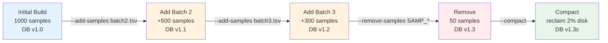

# Update a Database

`afquery update-db` supports three operations: adding new samples, removing existing samples, and compacting the database to reclaim space.

### Update Timeline



---

## Add Samples

Provide a new manifest TSV with the samples to add:

```bash
afquery update-db \
  --db ./db/ \
  --add-samples new_samples.tsv
```

The new manifest follows the same format as the original (see [Manifest Format](manifest-format.md)). New samples are assigned monotonically increasing sample IDs.

To add multiple manifests at once:

```bash
afquery update-db \
  --db ./db/ \
  --add-samples batch1.tsv \
  --add-samples batch2.tsv
```

For WES samples, provide the BED file directory:

```bash
afquery update-db \
  --db ./db/ \
  --add-samples new_samples.tsv \
  --bed-dir ./beds/
```

---

## Remove Samples

Remove one or more samples by name:

```bash
afquery update-db \
  --db ./db/ \
  --remove-samples SAMP_001
```

Remove multiple samples:

```bash
afquery update-db \
  --db ./db/ \
  --remove-samples SAMP_001,SAMP_002,SAMP_003
```

Or repeat the flag:

```bash
afquery update-db \
  --db ./db/ \
  --remove-samples SAMP_001 \
  --remove-samples SAMP_002
```

!!! note
    Removal marks the sample as inactive and clears its bit from all bitmaps. The physical bit position is not reused. Run `--compact` after removing many samples to reclaim disk space.

---

## Compact

After removing samples, compact the database to remove dead bits and reduce disk usage:

```bash
afquery update-db \
  --db ./db/ \
  --compact
```

This rewrites all Parquet files, removing bits for deleted samples. For large databases, compact runs in parallel and may take several minutes.

### When to Compact

- After removing more than 5–10% of samples
- When disk space is a concern
- Before archiving or sharing the database

---

## Combine Operations

Operations can be combined in a single command:

```bash
afquery update-db \
  --db ./db/ \
  --remove-samples SAMP_OLD_001 \
  --add-samples new_cohort.tsv \
  --compact
```

Operations execute in this order: remove → add → compact.

---

## Database Version

By default, the version label auto-increments (e.g., `1.0` → `2.0`). Set a custom version:

```bash
afquery update-db \
  --db ./db/ \
  --add-samples new_samples.tsv \
  --db-version 2026.03
```

---

## View Changelog

Every update operation is logged. View the history:

```bash
afquery info --db ./db/ --changelog
```

Example output:
```
v1.0  2026-01-15  create   1371 samples added
v2.0  2026-02-01  add       42 samples added
v2.0  2026-02-15  remove     3 samples removed
v3.0  2026-03-01  compact   compacted after removal
```

---

## Incremental Growth Workflow

For a production database that grows over time:

```bash
# Month 1: initial build
afquery create-db --manifest month1.tsv --output-dir ./db/ --genome-build GRCh38

# Month 2: add new samples
afquery update-db --db ./db/ --add-samples month2.tsv

# Month 3: add more; remove withdrawn consent
afquery update-db --db ./db/ \
  --add-samples month3.tsv \
  --remove-samples WITHDRAWN_001,WITHDRAWN_002

# Compact when many samples removed
afquery update-db --db ./db/ --compact
```

---

## Full Option Reference

See [CLI Reference → update-db](../reference/cli.md#update-db).
