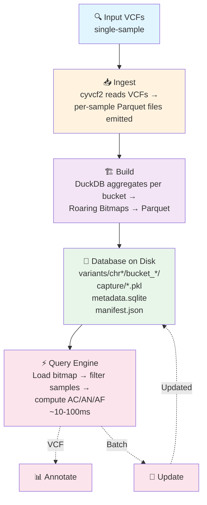

# AFQuery

**Fast, file-based genomic allele frequency queries for large cohorts. No server, no cloud — just files.**

AFQuery stores genotype data as Roaring Bitmaps in Parquet files and answers allele frequency queries in under 100 ms across large cohorts, with flexible filtering by sex, metadata codes (arbitrary sample labels), and sequencing technology.

---

## Problem Statement

Large-scale genomic cohort studies require fast, flexible computation of allele frequencies across dynamically defined sample subsets. Existing tools for allele frequency computation — including bcftools, VCFtools, and GATK — operate on static VCF files and require reprocessing the entire cohort when the sample set or filter criteria change. This design is adequate for one-time analyses but is prohibitive for interactive clinical variant interpretation, where a researcher may need to compute AF over dozens of different subsets (by sex, phenotype, technology, or arbitrary combinations) in a single session.

A second limitation of general-purpose VCF tools is their lack of metadata-aware filtering. Computing AF over a subgroup — for example, male samples without a specific phenotype — requires pre-selecting samples by external metadata, subsetting the VCF, and then running AF computation. This multi-step process precludes real-time exploratory analysis.

A third limitation concerns cohorts with mixed sequencing technologies. Computing allele frequency from a cohort that includes WGS, multiple WES kits, and targeted gene panels requires accounting for the genomic regions actually sequenced by each technology. A position covered by WGS and WES_KIT_1 but not by WES_KIT_2 or a cardiac gene panel must exclude the uncovered samples from AN — otherwise the denominator is inflated and AF is underestimated. This problem is compounded when multiple versions of the same capture kit are used, since kit versions may differ by only a few hundred base pairs at capture boundaries. Computing per-position AN correctly across dozens of BED files manually is prohibitively complex; no general-purpose VCF tool automates this.

```mermaid
gantt
    title Sequencing Coverage by Technology (illustrative)
    dateFormat X
    axisFormat %s

    section WGS
    Full coverage :done, wgs, 0, 100

    section WES_KIT_1
    Region A :done, k1a, 10, 25
    Region B :done, k1b, 40, 55
    Region C :done, k1c, 65, 80
    Region D :done, k1d, 85, 95

    section WES_KIT_2_v1
    Region A' :done, k2v1a, 10, 25
    Region E  :done, k2v1e, 70, 82

    section WES_KIT_2_v2
    Region A'' :done, k2v2a, 13, 25
    Region E'  :done, k2v2e, 70, 84
```

A fourth limitation is the reliance on public population databases for frequency-based variant filtering. Databases such as gnomAD are invaluable for identifying common variants, but growing evidence shows that local cohort frequencies outperform global databases for clinical variant classification — particularly for underrepresented ancestries. A variant classified as rare in gnomAD Europeans (AF=0.001) may be 10-fold more common in an Iberian registry (AF=0.01), directly affecting ACMG BS1 and PM2 criteria [1,2]. Population-specific sequencing artifacts and disease-enrichment patterns in the cohort further reinforce the need for local frequency computation [3,4].

## Approach

AFQuery introduces a pre-indexed database architecture that separates the slow step (building the genotype index from raw VCFs) from the fast step (querying allele frequencies on arbitrary subcohorts). The key data structure is the **Roaring Bitmap**, a compressed bitset that represents, for each variant, the set of samples carrying the alternate allele. At query time, computing AC/AN/AF requires only:

1. Loading the relevant bitmaps from Parquet storage
2. Intersecting with the bitmap of eligible samples (determined by sex, metadata, and capture filters)
3. Summing bits (popcount)

This reduces the per-query work to microsecond-scale bitmap operations, achieving sub-100 ms end-to-end latency including Parquet I/O.

---

## Features

AFQuery addresses the following methodological gaps not covered by existing tools:

### 1. Dynamic subcohort queries at sub-100 ms latency

Existing bioinformatics tools (i.e. bcftools) scan VCF files linearly, scaling with file size. AFQuery queries execute in under 100 ms regardless of cohort size, because queries access only the bitmaps for the relevant position rather than scanning the full dataset.

### 2. Incremental database updates without reprocessing

When new samples are added to the cohort, AFQuery merges new genotype data into the existing bitmap index without rebuilding from scratch. This enables real-time cohort growth in clinical settings where samples are added continuously.

### 3. Multi-dimensional metadata filtering

AFQuery supports simultaneous filtering by sex, arbitrary metadata codes, and sequencing technology, with both inclusion and exclusion semantics. Metadata codes are arbitrary strings defined by the user — ICD-10 codes, HPO terms, project tags, or any user-defined labels. No controlled vocabulary is required.

### 4. Server-less, portable database format

The AFQuery database is a directory of standard Parquet files with a SQLite metadata database. It requires no server process, can be shared by copying, and can be queried from any machine with AFQuery installed. This is particularly valuable for clinical and research settings where infrastructure deployment is constrained.

### 5. Ploidy-aware AF

AFQuery correctly handles PAR and non-PAR regions on chrX and chrY and chrMT ploidy rules per sample (i.e. Males at chrX non-PAR contribute AN=1; females contribute AN=2). This ensures accurate hemizygous frequency computation for X-linked variant analysis without manual adjustment.

### 6. Sequencing technology aware

AFQuery correctly computes AN by intersecting each sample's capture BED with the queried position, even when the cohort mixes WGS, WES kits, and gene panels (including different versions of the same kit). This ensures accurate frequency estimates without artificial bias from technology-dependent coverage differences.

### 7. VCF annotation with custom sample subsets

Annotate a patient VCF with `AFQUERY_AC`, `AFQUERY_AN`, `AFQUERY_AF`, `AFQUERY_N_HET`, `AFQUERY_N_HOM_ALT`, `AFQUERY_N_HOM_REF`, and `AFQUERY_N_FAIL` INFO fields computed from any combination of phenotype, sex, and technology filters.

### 8. Audit changelog

Every database operation (sample add, remove, or metadata update) is recorded in a tamper-evident changelog, ensuring result reproducibility and auditability.

## When to Use AFQuery

- You need allele frequencies for **phenotype-defined subcohorts** (not just whole-population AF)
- You mix **WGS, WES, and panels** in one cohort and need technology-aware AN
- You require **reproducible local AF** computed on your own samples — not just public reference databases
- You run **repeated queries** on the same dataset (annotation, clinical interpretation, research)
- You need **sub-100 ms query latency** without database servers or cloud infrastructure

---

## Architecture

---

## Next Steps

- [Installation](getting-started/installation.md) — pip, conda, from source
- [Quickstart](getting-started/quickstart.md) — 5-minute end-to-end tutorial
- [Key Concepts](getting-started/concepts.md) — bitmaps, Parquet, manifest, metadata model

---

## References

1. Agaoglu NB et al. (2024). Genomic disparity impacts variant classification of cancer susceptibility genes in Turkish breast cancer patients. *Cancer Medicine*. PMID: 38308423
2. Dawood M et al. (2024). Using multiplexed functional data to reduce variant classification inequities in underrepresented populations. *Genome Medicine*. PMID: 39627863
3. Han S et al. (2023). Integrative analysis of germline rare variants in clear and non-clear cell renal cell carcinoma. PMID: 36712083
4. Huang Y-S et al. (2026). From enrichment to interpretation: PS4-driven reclassification in Taiwanese inherited retinal degeneration. *Human Genomics*. PMID: 41692763
