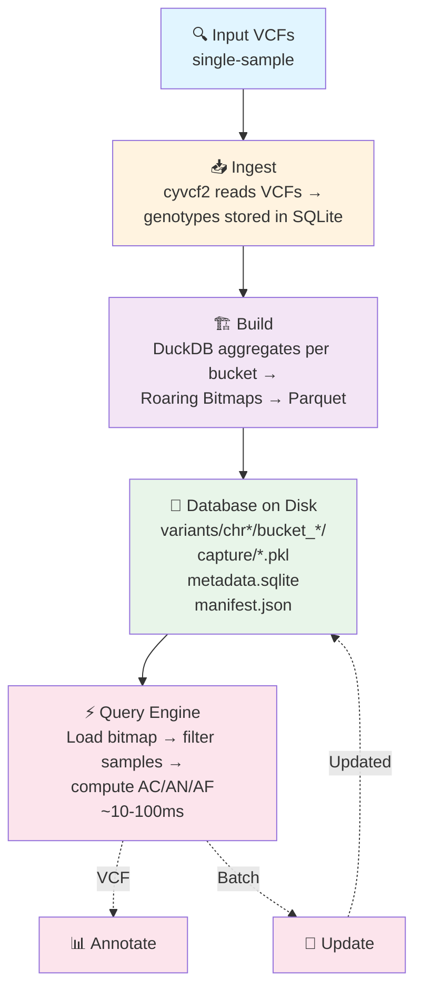

# AFQuery

**Fast, file-based genomic allele frequency queries for large cohorts. No server, no cloud — just files.**

AFQuery stores genotype data as Roaring Bitmaps in Parquet files and answers allele frequency queries in under 100 ms across large cohorts, with flexible filtering by sex, metadata codes (arbitrary sample labels), and sequencing technology.

---

## Problem Statement

Large-scale genomic cohort studies require fast, flexible computation of allele frequencies across dynamically defined sample subsets. Existing tools for allele frequency computation — including bcftools, VCFtools, and GATK — operate on static VCF files and require reprocessing the entire cohort when the sample set or filter criteria change. This design is adequate for one-time analyses but is prohibitive for interactive clinical variant interpretation, where a researcher may need to compute AF over dozens of different subsets (by sex, phenotype, technology, or arbitrary combinations) in a single session.

A second limitation of general-purpose VCF tools is their lack of metadata-aware filtering. Computing AF over a subgroup — for example, male samples without a specific phenotype — requires pre-selecting samples by external metadata, subsetting the VCF, and then running AF computation. This multi-step process precludes real-time exploratory analysis.

NOTA_PARA_LLM: Añadir la limitación de usar cohortes con tecnologías mixtas. El cálculo de AF a partir de VCFs en cohortes donde se mezclan distintas tecnologías (WGS, WES, panel de genes) implica un tratamiento adecuado de la zona secuenciada en cada muestra para el cálculo del AN. Incluso en cohortes donde se usan distintas versiones de un mismo kit de captura (i.e. AgilentSureSelectV5 y AgilentSureSelectV6) existen diferencias en las zonas capturadas que deben tratarse adecuadamente para el cálculo de AN.

NOTA_PARA_LLM: El uso de grandes bases de datos poblacionales como gnomAD es adecuado para un primer filtrado de variantes. Sin embargo existen evidencias en la literatura de que el uso de cohortes locales para el filtrado mejora los resultados, ya que permite hacer una estimación más aproximada de las AF debido a las variaciones naturales en la ancestralidad de las subpoblaciones (por ejemplo una variante AF=0.001 en gnomad europea puede ser AF=0.01 en la población Ibérica, cambiando la patogenicidad de la variable en base a los criterios ACMG), permite reducir errores debidos a artefatos de secuenciación, 

NOTA_PARA_LLM: Considerar la posibilidad de añadir un nuevo gráfico mermaid que represente de forma visual la problemática del uso de distintas tecnologías de secuenciación en una misma cohorte. El gráfico debe mostrar en un estilo parecido a IGV arriba el genoma de referencia y debajo distintos beds de captura: uno será WGS, que cubra todo el genoma de referencia. Otro será WES_KIT1, que cubran 4 regiones simulando un bed de captura. Otro será WES_KIT2_V1, que cubra las primeras 2 regiones de WES_KIT1 con un solapamiento parcial y las otras 2 regiones distintas que no tengan ningún solapamiento con WES_KIT1. Y finalmente habrá otro track que será WES_KIT2_V2, que sea muy parecido a WES_KIT2_V1 pero con ligeras deferencias.

## Approach

AFQuery introduces a pre-indexed database architecture that separates the slow step (building the genotype index from raw VCFs) from the fast step (querying allele frequencies on arbitrary subcohorts). The key data structure is the **Roaring Bitmap**, a compressed bitset that represents, for each variant, the set of samples carrying the alternate allele. At query time, computing AC/AN/AF requires only:

1. Loading the relevant bitmaps from Parquet storage
2. Intersecting with the bitmap of eligible samples (determined by sex, metadata, and capture filters)
3. Summing bits (popcount)

This reduces the per-query work to microsecond-scale bitmap operations, achieving sub-100 ms end-to-end latency including Parquet I/O.

---

## Features

AFQuery addresses the following methodological gaps not covered by existing tools:

### 1. Dynamic subcohort queries at sub-100 ms latency

Existing bioinformatics tools (i.e. bcftools) scan VCF files linearly, scaling with file size. AFQuery queries execute in under 100 ms regardless of cohort size, because queries access only the bitmaps for the relevant position rather than scanning the full dataset.

### 3. Multi-dimensional metadata filtering

AFQuery supports simultaneous filtering by sex, arbitrary metadata codes, and sequencing technology, with both inclusion and exclusion semantics. Metadata codes are arbitrary strings defined by the userr — ICD-10 codes, HPO terms, project tags, or any user-defined labels. No controlled vocabulary is required.

### 6. Sequencing technology aware

AFQuery correctly computes AN by intersecting each sample's capture BED with the queried position, even when the cohort mixes WGS, WES kits, and gene panels (including different versions of the same kit). This ensures accurate frequency estimates without artificial bias from technology-dependent coverage differences.

### 5. Ploidy-aware AF

AFQuery correctly handles PAR and non-PAR regions on chrX and chrY and chrMT ploidy rules per sample (i.e. Males at chrX non-PAR contribute AN=1; females contribute AN=2). This ensures accurate hemizygous frequency computation for X-linked variant analysis without manual adjustment.

### 7. VCF annotation with custom sample subsets

Annotate a patient VCF with `AFQUERY_AC`, `AFQUERY_AN`, and `AFQUERY_AF` INFO fields computed from any combination of phenotype, sex, and technology filters.

### 8. Audit changelog

Every database operation (sample add, remove, or metadata update) is recorded in a tamper-evident changelog, ensuring result reproducibility and auditability.

### 2. Incremental database updates without reprocessing

When new samples are added to the cohort, AFQuery merges new genotype data into the existing bitmap index without rebuilding from scratch. This enables real-time cohort growth in clinical settings where samples are added continuously.

### 4. Server-less, portable database format

The AFQuery database is a directory of standard Parquet files with a SQLite metadata database. It requires no server process, can be shared by copying, and can be queried from any machine with AFQuery installed. This is particularly valuable for clinical and research settings where infrastructure deployment is constrained.

## When to Use AFQuery

- You need allele frequencies for **phenotype-defined subcohorts** (not just whole-population AF)
- You mix **WGS, WES, and panels** in one cohort and need technology-aware AN
- You require **reproducible local AF** computed on your own samples — not just public reference databases
- You run **repeated queries** on the same dataset (annotation, clinical interpretation, research)
- You need **sub-100 ms query latency** without database servers or cloud infrastructure

---

## Architecture

---

## Next Steps

- [Installation](getting-started/installation.md) — pip, conda, from source
- [Quickstart](getting-started/quickstart.md) — 5-minute end-to-end tutorial
- [Key Concepts](getting-started/concepts.md) — bitmaps, Parquet, manifest, metadata model
