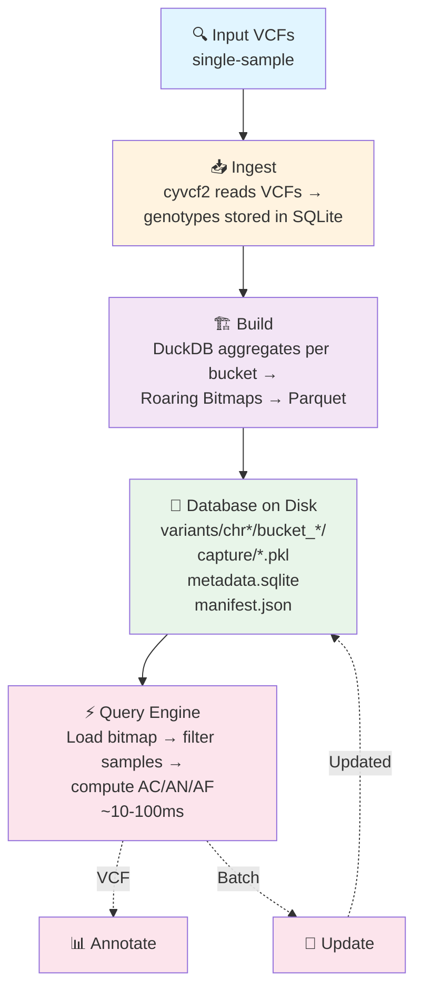

# AFQuery

**Fast, file-based genomic allele frequency queries for large cohorts. No server, no cloud — just files.**

AFQuery stores genotype data as Roaring Bitmaps in Parquet files and answers allele frequency queries in under 100 ms across 10K–50K samples, with flexible filtering by sex, metadata codes (arbitrary sample labels), and sequencing technology.

---

## When to Use AFQuery

- You need allele frequencies for **phenotype-defined subcohorts** (not just whole-population AF)
- You mix **WGS, WES, and panels** in one cohort and need technology-aware AN
- You require **reproducible local AF** computed on your own samples — not just gnomAD
- You run **repeated queries** on the same dataset (annotation, clinical interpretation, research)
- You need **sub-100 ms query latency** without database servers or cloud infrastructure

## When NOT to Use AFQuery

- **Single-sample analysis** — AFQuery requires a cohort; for one sample, use standard VCF tools
- **Population-scale datasets (>100K samples)** — AFQuery targets 10K–50K samples; for larger scale, consider hail or glow
- **De novo variant calling** — AFQuery queries pre-called genotypes; it does not call variants

---

## Features

- **Sub-100 ms point queries** on 50K-sample cohorts, ~10 ms warm
- **Filter by sex, metadata codes, and sequencing technology** — any combination; codes are arbitrary strings defined in your manifest
- **Ploidy-aware AN** for sex chromosomes (chrX, chrY, chrMT)
- **Roaring Bitmap compression** — ~2 bytes/sample/variant typical storage
- **Incremental updates** — add or remove samples without full rebuild
- **VCF annotation** with custom sample subsets
- **Bulk export** disaggregated by sex, technology, or phenotype
- **Zero infrastructure** — purely file-based, no server required

---

## Architecture



---

## Quick Start

```bash
# 1. Install
pip install afquery

# 2. Build a database from your VCFs
afquery create-db \
  --manifest samples.tsv \
  --output-dir ./db/ \
  --genome-build GRCh38

# 3. Query allele frequency
afquery query \
  --db ./db/ \
  --chrom chr1 \
  --pos 123456 \
  --phenotype E11.9 \  # E11.9 is an ICD-10 example; any metadata label works
  --sex female

# 4. Annotate a VCF
afquery annotate \
  --db ./db/ \
  --input variants.vcf \
  --output annotated.vcf
```

!!! tip "Performance"
    Sub-100 ms cold point queries. ~10 ms warm. Scales to 50K samples with no infrastructure changes.

---

## Next Steps

- [Installation](getting-started/installation.md) — pip, conda, from source
- [Preprocessing](getting-started/preprocessing.md) — normalize VCFs before ingestion
- [Quickstart](getting-started/quickstart.md) — 5-minute end-to-end tutorial
- [Key Concepts](getting-started/concepts.md) — bitmaps, Parquet, manifest, metadata model
