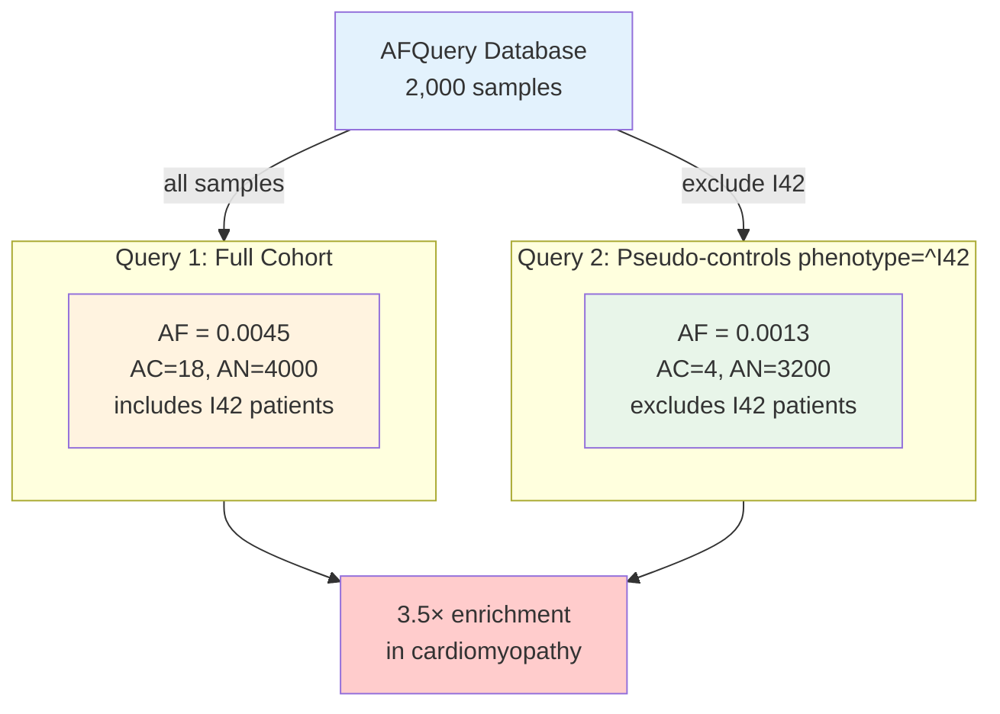

NOTA_PARA_LLM: Reescribir completamente la guía de pseudocontroles. La idea clave de usar pseudocontroles es usar pacientes no sanos como controles cuando la enfermedad de estudio no comparte una arquitectura genética común con los controles. Por ejemplo, se puede usar una cohorte de individuos diagnosticados con una cardiopatía para detectar retinopatías, ya que ambas enfermedades no están relacionadas genéticamente (las frecuencias de las variantes en genes relacionados con retinopatías son, a efectos prácticos, similares a las de un paciente sano). Esto es una gran ventaja para, por ejemplo, hospitales, ya que normalmente las cohortes locales se crean a partir de individuos con sospecha de alguna enfermedad genética (no se manda a secuenciar individuos sin sospecha de enfermedad genética). Esto hace que, a efectos práticos, sea muy complicado poder usar una cohorte local de individuos sanos para el filtrado. Aquí es donde entra en juego AFQuery, ya que permite selecionar dinámicamente los controles, exluyendo todos los fenotipos que puedan estar relacionados con la enfermedad de estudio. Redacta de nuevo esta página para expresar esta idea. 

# Pseudo-controls

## Scenario

You have a cohort of 2,000 samples including patients with cardiomyopathy (ICD-10 code `I42`) and patients with other conditions. You want to compute allele frequency for a candidate pathogenic variant using only the non-cardiomyopathy samples as a "background" frequency.


### Query Stratification

AFQuery's phenotype exclusion filter (`^CODE`) lets you exclude a specific group at query time — without modifying or rebuilding the database. Any sample not tagged `I42` becomes a pseudo-control for cardiomyopathy analysis:



## Step-by-Step Example

### 1. Manifest setup

Your manifest tags cardiomyopathy patients:

```tsv
sample_name	vcf_path	sex	tech_name	phenotype_codes
SAMP_001	vcfs/SAMP_001.vcf.gz	female	wgs	I42,I10
SAMP_002	vcfs/SAMP_002.vcf.gz	male	wgs	I42
SAMP_003	vcfs/SAMP_003.vcf.gz	female	wgs	I10
SAMP_004	vcfs/SAMP_004.vcf.gz	male	wgs	control
...
```

### 2. Query all samples (includes disease group)

```bash
afquery query --db ./db/ --locus chr1:925952 --format tsv
```

```
chrom	pos	ref	alt	AC	AN	AF	N_HET	N_HOM_ALT
chr1	925952	G	A	18	4000	0.00450	16	1
```

### 3. Query pseudo-controls (exclude cardiomyopathy)

```bash
afquery query --db ./db/ --locus chr1:925952 --phenotype ^I42 --format tsv
```

```
chrom	pos	ref	alt	AC	AN	AF	N_HET	N_HOM_ALT
chr1	925952	G	A	4	3200	0.00125	4	0
```

### 4. Python API

```python
from afquery import Database

db = Database("./db/")

# Full cohort
full = db.query("chr1", pos=925952)

# Pseudo-controls (exclude cardiomyopathy)
controls = db.query("chr1", pos=925952, phenotype=["^I42"])

print(f"Full cohort AF: {full[0].AF:.5f}")    # 0.00450
print(f"Pseudo-control AF: {controls[0].AF:.5f}")  # 0.00125
```

## Biological Interpretation

The variant is at AF=0.0045 in the full cohort but AF=0.0013 in pseudo-controls. This 3.5× enrichment in cardiomyopathy patients suggests disease association. Using pseudo-controls as the background frequency provides a cleaner signal compared to using a general population database where disease carriers may be present but untagged.

**Key advantage**: The pseudo-control query runs in under 100 ms. No database rebuild is needed — you can explore different disease stratifications interactively.

## Related Features

- [Sample Filtering](../guides/sample-filtering.md) — full phenotype filter syntax
- [Cohort Stratification](cohort-stratification.md) — compare multiple groups
- [Clinical Prioritization](clinical-prioritization.md) — annotate patient VCFs
