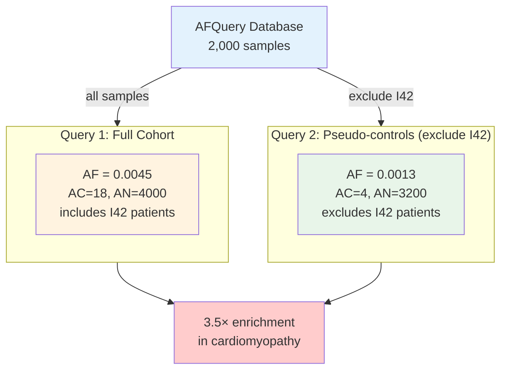

# Pseudo-Controls: Using Unrelated Patients as Background Frequency

## The Clinical Challenge

Hospital genomics laboratories rarely sequence healthy individuals. Sequencing is ordered for patients with suspected genetic disease — meaning any local cohort is, by definition, enriched for disease. This creates a fundamental problem: **you have no healthy controls to use as background frequency**.

Public databases (gnomAD) fill this gap partially, but they may not match your cohort's ancestry, capture technology, or phenotypic composition (see [Why Cohort-Specific AF Matters](../getting-started/concepts.md#why-cohort-specific-af-matters)).

## The Pseudo-Control Strategy

The key insight is that **not all diseases share the same genetic architecture**. A patient diagnosed with cardiomyopathy is not enriched — compared to the general population — for variants in retinal degeneration genes. Their variant frequencies in *unrelated* gene sets are, for practical purposes, equivalent to those of a healthy individual.

AFQuery enables you to dynamically select pseudo-controls by **excluding samples with phenotypes related to the disease under study** at query time — without modifying or rebuilding the database.



## When Is This Valid?

Pseudo-controls are appropriate when:

- The excluded phenotype is **genetically unrelated** to the study disease
- The remaining cohort is **large enough** (AN ≥ 100 recommended)
- You want to test for **variant enrichment** in a specific disease group

Examples of valid pseudo-control pairs:

| Study disease | Exclude from pseudo-controls |
|--------------|------------------------------|
| Retinopathy | Cardiomyopathy patients (`I42`) |
| Epilepsy | Metabolic disease patients (`E70–E90`) |
| Hearing loss | Oncology patients |
| Cardiomyopathy | Ophthalmology patients |

## Example: Cardiomyopathy Study

### 1. Manifest setup

Your manifest tags each sample with relevant ICD-10 codes:

```tsv
sample_name	vcf_path	sex	tech_name	phenotype_codes
SAMP_001	vcfs/SAMP_001.vcf.gz	female	wgs	I42,I10
SAMP_002	vcfs/SAMP_002.vcf.gz	male	wgs	I42
SAMP_003	vcfs/SAMP_003.vcf.gz	female	wgs	I10
SAMP_004	vcfs/SAMP_004.vcf.gz	male	wgs	H35
...
```

No special setup is required — pseudo-controls are defined entirely at query time.

### 2. Query full cohort

```bash
afquery query --db ./db/ --locus chr1:925952 --format tsv
```

```
chrom	pos	ref	alt	AC	AN	AF	n_eligible	N_HET	N_HOM_ALT	N_HOM_REF	N_FAIL
chr1	925952	G	A	18	4000	0.00450	2000	16	1	1983	0
```

### 3. Query pseudo-controls (exclude cardiomyopathy)

```bash
afquery query --db ./db/ --locus chr1:925952 --phenotype ^I42 --format tsv
```

```
chrom	pos	ref	alt	AC	AN	AF	n_eligible	N_HET	N_HOM_ALT	N_HOM_REF	N_FAIL
chr1	925952	G	A	4	3200	0.00125	1600	4	0	1596	0
```

The variant is 3.5× enriched in cardiomyopathy patients versus the pseudo-control background.

### 4. Python API

```python
from afquery import Database

db = Database("./db/")

# Full cohort
full = db.query("chr1", pos=925952)

# Pseudo-controls (exclude cardiomyopathy)
controls = db.query("chr1", pos=925952, phenotype=["^I42"])

enrichment = full[0].AF / controls[0].AF
print(f"Full cohort AF:      {full[0].AF:.5f}")     # 0.00450
print(f"Pseudo-control AF:   {controls[0].AF:.5f}") # 0.00125
print(f"Enrichment:          {enrichment:.1f}×")    # 3.5×
```

## Biological Interpretation

The pseudo-control AF provides a cleaner background frequency than a gnomAD lookup because:

- It reflects the **same sequencing technology** and **same capture kit** as your cases
- It controls for **population-level AF** in your specific ancestry
- It is not subject to the disease enrichment that may be present even in gnomAD (patients with undiagnosed genetic conditions may be included in population databases)

**Key advantage**: The pseudo-control query runs in under 100 ms. No database rebuild is needed — you can explore different disease stratifications interactively within a single clinical session.

## Related Features

- [Sample Filtering](../guides/sample-filtering.md) — full phenotype filter syntax
- [Cohort Stratification](cohort-stratification.md) — compare multiple groups simultaneously
- [Clinical Prioritization](clinical-prioritization.md) — annotate patient VCFs with cohort-specific AF
